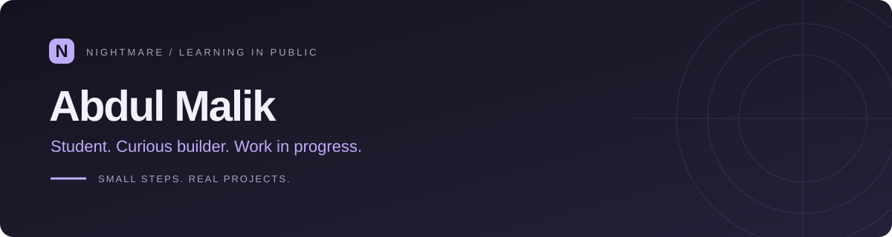

Turning small ideas into useful software, one project at a time.

### A little about me

I'm a student learning coding through hands-on projects. I use AI to help me build, ask better questions, and understand how the pieces fit together.

### What I'm exploring

🌐 **Web development** — making ideas work in a browser  
🗃️ **Databases & APIs** — understanding how apps store and share information  
✦ **AI tools** — learning to build with them and understand the results

### My approach

**Build → Understand → Improve → Share**

This profile is the starting point of that journey. More projects as I learn.

---

Small steps. Real projects. Steady progress.

